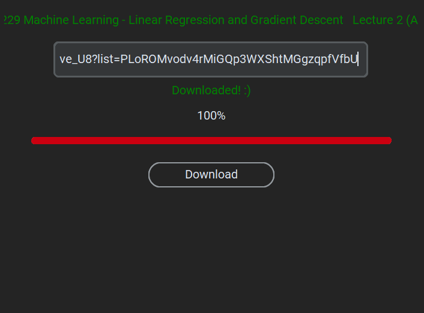

# YouTube Video Downloader

This is a simple YouTube video downloader application built with Python using the `tkinter` and `customtkinter` libraries for the graphical user interface (GUI). It leverages the `pytubefix` library to download videos from YouTube and `Pillow` for image handling.

## Features
- Download YouTube videos in the highest available resolution.
- Displays the download progress as a percentage and a progress bar.
- Simple and clean GUI using `customtkinter`.
- Shows video title and download status.

## Screenshots

